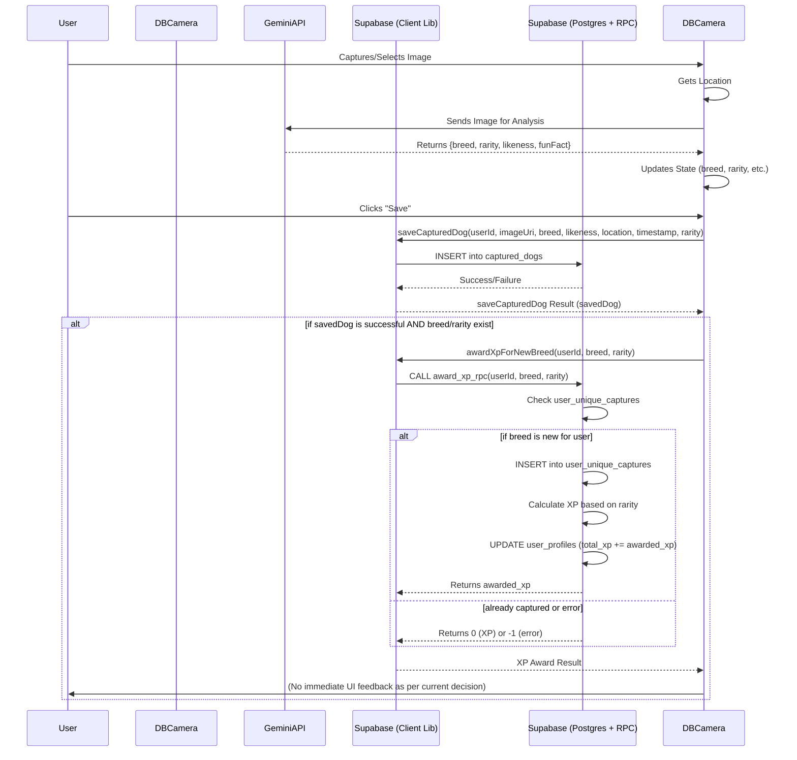

# XP Feature Implementation Plan

**Goal:** Award users XP for capturing a new, unique dog breed, with XP varying by breed rarity. Display total XP on the user's profile.

## 1. Database Schema Changes (Supabase)

We'll need two new tables:

*   **`user_profiles`**: To store total XP and potentially other user-specific stats.
    *   `user_id` (UUID, Primary Key, Foreign Key referencing `auth.users.id`)
    *   `total_xp` (INTEGER, NOT NULL, DEFAULT 0)

*   **`user_unique_captures`**: To track the unique breeds each user has captured.
    *   `user_id` (UUID, Foreign Key referencing `auth.users.id`)
    *   `breed_name` (TEXT, NOT NULL)
    *   `captured_at` (TIMESTAMPTZ, DEFAULT NOW())
    *   PRIMARY KEY (`user_id`, `breed_name`)

**SQL for Table Creation:**

```sql
-- Table to store user profiles and their total XP
CREATE TABLE public.user_profiles (
  user_id UUID PRIMARY KEY REFERENCES auth.users(id) ON DELETE CASCADE,
  total_xp INTEGER NOT NULL DEFAULT 0
);

-- Enable Row Level Security (RLS) for user_profiles
ALTER TABLE public.user_profiles ENABLE ROW LEVEL SECURITY;

-- Policy: Users can view their own profile
CREATE POLICY "Allow users to view their own profile"
ON public.user_profiles FOR SELECT
USING (auth.uid() = user_id);

-- Policy: Allow backend (e.g. service_role or security definer functions) to update profiles
CREATE POLICY "Allow backend to update profiles"
ON public.user_profiles FOR UPDATE
USING (true); -- Or more restrictive if needed, e.g. specific roles

-- Table to track unique dog breeds captured by each user
CREATE TABLE public.user_unique_captures (
  user_id UUID NOT NULL REFERENCES auth.users(id) ON DELETE CASCADE,
  breed_name TEXT NOT NULL,
  captured_at TIMESTAMPTZ DEFAULT NOW(),
  PRIMARY KEY (user_id, breed_name)
);

-- Enable Row Level Security (RLS) for user_unique_captures
ALTER TABLE public.user_unique_captures ENABLE ROW LEVEL SECURITY;

-- Policy: Users can view their own unique captures
CREATE POLICY "Allow users to view their own unique captures"
ON public.user_unique_captures FOR SELECT
USING (auth.uid() = user_id);

-- Policy: Allow users to insert their own unique captures (will be called by RPC function)
CREATE POLICY "Allow users to insert their own unique captures"
ON public.user_unique_captures FOR INSERT
WITH CHECK (auth.uid() = user_id);
```

## 2. Automatic Profile Creation (Supabase Function & Trigger)

To ensure every user has a profile, we'll create a Supabase function that triggers on new user signup.

*   **PL/pgSQL Function `public.handle_new_user()`:**
    ```sql
    CREATE OR REPLACE FUNCTION public.handle_new_user()
    RETURNS TRIGGER
    LANGUAGE plpgsql
    SECURITY DEFINER -- Important for functions that modify data based on auth
    AS $$
    BEGIN
      INSERT INTO public.user_profiles (user_id, total_xp)
      VALUES (NEW.id, 0);
      RETURN NEW;
    END;
    $$;
    ```

*   **Trigger `on_auth_user_created`:**
    ```sql
    CREATE TRIGGER on_auth_user_created
      AFTER INSERT ON auth.users
      FOR EACH ROW
      EXECUTE FUNCTION public.handle_new_user();
    ```

## 3. XP Calculation and Awarding Logic (Supabase RPC Function)

*   **XP Values by Rarity:**
    *   Common: 10 XP
    *   Uncommon: 25 XP
    *   Rare: 50 XP
    *   Super Rare: 100 XP
    *   Unknown/Other: 0 XP

*   **Supabase RPC Function `award_xp_rpc`:**
    ```sql
    CREATE OR REPLACE FUNCTION award_xp_rpc(p_user_id UUID, p_breed_name TEXT, p_rarity TEXT)
    RETURNS INTEGER
    LANGUAGE plpgsql
    SECURITY DEFINER -- Define security context if needed, or run as invoker if RLS handles permissions
    AS $$
    DECLARE
      xp_to_award INTEGER := 0;
      already_captured BOOLEAN;
    BEGIN
      -- Check if already captured by this user
      SELECT EXISTS (
        SELECT 1
        FROM public.user_unique_captures
        WHERE user_id = p_user_id AND breed_name = p_breed_name
      ) INTO already_captured;

      IF NOT already_captured THEN
        -- Insert into unique captures
        -- This will be executed with the permissions of the calling user if SECURITY INVOKER
        -- or definer if SECURITY DEFINER. Ensure RLS allows this.
        INSERT INTO public.user_unique_captures (user_id, breed_name)
        VALUES (p_user_id, p_breed_name);

        -- Determine XP based on rarity
        CASE p_rarity
          WHEN 'Common' THEN xp_to_award := 10;
          WHEN 'Uncommon' THEN xp_to_award := 25;
          WHEN 'Rare' THEN xp_to_award := 50;
          WHEN 'Super Rare' THEN xp_to_award := 100;
          ELSE xp_to_award := 0; -- Default for 'Unknown' or other values
        END CASE;

        -- Update total_xp in user_profiles
        IF xp_to_award > 0 THEN
          -- This update should be allowed by RLS on user_profiles (e.g., by a service role or SECURITY DEFINER function)
          UPDATE public.user_profiles
          SET total_xp = total_xp + xp_to_award
          WHERE user_id = p_user_id;
        END IF;

        RETURN xp_to_award;
      ELSE
        RETURN 0; -- Already captured, no XP
      END IF;
    EXCEPTION
      WHEN OTHERS THEN
        -- Log error if necessary, or handle specific exceptions
        RAISE WARNING 'Error in award_xp_rpc for user %: %', p_user_id, SQLERRM;
        RETURN -1; -- Indicate an error
    END;
    $$;
    ```

## 4. Client-Side Integration

*   **Modify `lib/supabase.ts`:**
    *   Add a new function `awardXpForNewBreed(userId: string, breedName: string, rarity: string): Promise<{ awardedXp: number; error: any }>`

        ```typescript
        // In lib/supabase.ts

        export async function awardXpForNewBreed(
          userId: string,
          breedName: string,
          rarity: string
        ): Promise<{ awardedXp: number; error: any }> {
          try {
            const { data, error } = await supabase.rpc('award_xp_rpc', {
              p_user_id: userId,
              p_breed_name: breedName,
              p_rarity: rarity,
            });

            if (error) {
              console.error('Error awarding XP via RPC:', error);
              return { awardedXp: 0, error };
            }
            // data directly contains the integer returned by the RPC function
            return { awardedXp: data === -1 ? 0 : (data || 0), error: data === -1 ? 'RPC Error' : null };
          } catch (rpcError) {
            console.error('Exception calling awardXpForNewBreed RPC:', rpcError);
            return { awardedXp: 0, error: rpcError };
          }
        }
        ```

*   **Modify `components/DogBreedCamera.tsx`:**
    *   Import `awardXpForNewBreed` from `lib/supabase.ts`.
    *   In `handleSaveImage`, after `saveCapturedDog` is successful:
        ```typescript
        // Inside handleSaveImage, after 'if (savedDog)' block
        if (savedDog && breed && rarity && user) { // Ensure breed and rarity are available
          console.log(`Attempting to award XP for: User ${user.id}, Breed ${breed}, Rarity ${rarity}`);
          const { awardedXp, error: xpError } = await awardXpForNewBreed(user.id, breed, rarity);
          if (xpError) {
            console.error('Failed to award XP:', xpError);
            // Optionally notify user of XP award failure (currently console log only)
          } else if (awardedXp > 0) {
            console.log(`Awarded ${awardedXp} XP for capturing ${breed}!`);
            // No immediate UI feedback toast as per current decision.
          } else {
            console.log('No XP awarded (either already captured, 0 XP for this rarity, or an error occurred).');
          }
        }
        ```

## 5. Displaying XP on Profile Screen

*   **Modify `app/(tabs)/profile.tsx`:**
    *   Add state for `totalXp`.
    *   Fetch `totalXp` when the component mounts or when the user changes.
        ```typescript
        // At the top of ProfileScreen component
        import { supabase } from '@/lib/supabase'; // Ensure supabase is imported
        // ... other imports
        const [totalXp, setTotalXp] = useState<number | null>(null);
        const [loadingXp, setLoadingXp] = useState(true);

        useEffect(() => {
          const fetchUserXp = async () => {
            if (user) {
              setLoadingXp(true);
              try {
                const { data, error } = await supabase
                  .from('user_profiles')
                  .select('total_xp')
                  .eq('user_id', user.id)
                  .single();

                if (error && error.code !== 'PGRST116') { // PGRST116: 0 rows
                  console.error('Error fetching user XP:', error);
                  setTotalXp(0);
                } else if (data) {
                  setTotalXp(data.total_xp);
                } else {
                  // Profile might not exist yet if trigger hasn't run or if it's a new user and no XP yet.
                  // Or if the user_profiles table is empty for this user.
                  console.log('No XP profile data found for user, defaulting to 0.');
                  setTotalXp(0);
                }
              } catch (e) {
                console.error('Exception fetching user XP:', e);
                setTotalXp(0);
              } finally {
                setLoadingXp(false);
              }
            } else {
              setTotalXp(null); // No user, no XP
              setLoadingXp(false);
            }
          };

          fetchUserXp();
          // Consider adding a listener for Supabase real-time updates on user_profiles if needed.
        }, [user]); // Re-fetch if user changes
        ```
    *   Add a new stat display in the `statsContainer`:
        ```tsx
        // Inside the statsContainer View in app/(tabs)/profile.tsx
        <View style={styles.stat}>
          <Text style={styles.statNumber}>{loadingXp ? '...' : totalXp ?? 0}</Text>
          <Text style={styles.statLabel}>Total XP</Text>
        </View>
        ```

## 6. XP Awarding Flow Diagram (Mermaid)



## 7. Summary of Decisions

*   **XP Values:** Common: 10, Uncommon: 25, Rare: 50, Super Rare: 100.
*   **Rarity Naming:** "Super Rare" will be used consistently.
*   **Error Handling:** Console logging for XP award errors is sufficient for now.
*   **Immediate XP Feedback:** No UI toast/notification for XP gained upon capture for this iteration.