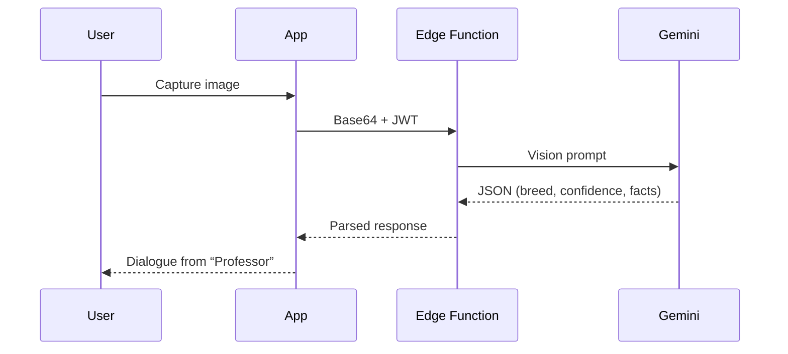

# Pawsidex: Gotta Snap 'Em All!

## Part I: Strategic Foundation & Market Landscape

This initial part of the report establishes the foundational strategy for **Pawsidex**. It defines the product's core identity, its unique and defensible position within the competitive landscape, and the strategic pillars upon which its development, launch, and future growth will be built. The analysis herein is derived from a comprehensive review of the current market, competitor offerings, user behaviors, and emerging technological capabilities.

### Section 1: The Core Vision & Unique Selling Proposition (USP)

At the heart of any successful product lies a clear vision and a compelling reason for its existence. This section articulates the fundamental concept of Pawsidex, defines its unique value in a crowded marketplace, and identifies the target audience it is designed to captivate.

#### 1.1 Defining the Product: More Than a Game, More Than a Utility

Pawsidex is formally defined as a **Real-World Discovery Game**. This strategic positioning is crucial. The mobile app market for dog lovers is currently bifurcated:

* **Virtual pet collection games** — e.g. \*Dog Game – The Dogs Collector!\*¹ — which offer simple, often passive collection loops within a purely digital world.
* **Utility apps** — e.g. *Dog Identifier*² — which provide functional services (breed identification) but often lack a compelling reason for sustained engagement.

Pawsidex transcends this dichotomy. It is not merely a game where users tap buttons to acquire virtual assets, nor is it a sterile utility used once and forgotten. Instead, it **transforms the user's physical world into a dynamic and ever-changing game board**. Every walk in the park, visit to a friend's house, or stroll through the city becomes an opportunity for discovery and collection. The core activity is active, not passive; it is rooted in real-world interaction, bridging the digital and physical in a way competitors do not. By gamifying real-world discovery, Pawsidex creates a new category of experience that is inherently more engaging than a simple utility and more meaningful than a standard virtual pet game.

#### 1.2 The Unique Selling Proposition (USP): *Snap-to-Collect*

The USP for Pawsidex is **“Snap-to-Collect”**: the seamless fusion of cutting-edge, AI-powered, real-world breed identification with deep, rewarding, persistent gamification.

Utility app *Dog Scanner*³ already teases this mechanic (“Catch all dog breeds”), proving market appetite. For Pawsidex, however, *Snap-to-Collect* is not an add-on; it is the polished **core**.

The technological heart of this USP is the **Google Gemini API**⁴. Beyond returning a breed label, Gemini can supply fun facts, temperament descriptions, and conversational flair⁵ — creating the magical “wow” moment that drives initial adoption and delight.

#### 1.3 Target Audience Deep Dive: The Modern Dog Enthusiast

* **Demographics:** 18-45 yrs, tech-savvy, active on Instagram/TikTok⁷, urban/suburban.
* **Psychographics:** Pets are family. They already use Rover, BringFido, GoodPup⁸. Curiosity drives them toward breed-identifier utilities¹⁰.
* **Behaviour:** Casual mobile gamers, motivated by achievement, social validation, completionism; members of pet communities such as *DogHood*¹¹.

Secondary audiences:

* **Families** – engaging, educational outdoor activity.
* **Competitive collectors** – motivated to “complete the Dex” and top leaderboards.

---

### Section 2: Competitive Arena & Opportunity Analysis

#### 2.1 Analysis of Competitors

| Category                   | Examples                                      | Strengths                      | Weaknesses                                 |
| -------------------------- | --------------------------------------------- | ------------------------------ | ------------------------------------------ |
| **Virtual Pet Collectors** | *Dog Game*¹, *Furry-Paws*¹³                   | Cute art, addictive loops      | Shallow gameplay, aggressive monetisation¹ |
| **AI Breed Identifiers**   | *Dog Scanner*³, *Dog Identifier*¹⁴, *Barky*¹⁰ | Genuine utility, high accuracy | Poor retention; ads & clunky UI¹⁵          |
| **Niche / Adjacent**       | *DogHood*¹¹                                   | Strong community features      | Not a game                                 |

#### 2.2 Competitive Feature Matrix

| App Name         | Core Mechanic                            | Gamification Depth                   | Monetization Model              | Key Weakness                               | Unique Feature               |
| ---------------- | ---------------------------------------- | ------------------------------------ | ------------------------------- | ------------------------------------------ | ---------------------------- |
| **Dog Game**¹    | Virtual dog collection & room decoration | Light (mini-games for currency)      | Freemium (Aggressive IAPs/Ads)  | Shallow gameplay; frustrating monetisation | 900 + virtual dogs           |
| **Dog Town**¹⁶   | Virtual dog breeding, training, care     | Medium (Quests, leveling)            | Freemium (IAPs/Ads)             | Intrusive ads; bugs                        | Breeding & training systems  |
| **Dog Scanner**³ | AI breed ID from photos                  | Light (“Catch all breeds” checklist) | Freemium (Ads, subscription)    | Weak retention; intrusive ads              | “Dog-twin” human scan        |
| **DogHood**¹¹    | Social networking for dog owners         | -                                    | Free                            | Niche; not a game                          | Map-based playdates/services |
| **Pawsidex**     | **Snap-to-Collect real dogs**            | **Deep** (XP, quests, achievements)  | **Hybrid** (Sub, cosmetic IAPs) | Needs access to real dogs                  | Memory-linked collection     |

#### 2.3 The Market Gap: **Meaningful Collection**

The landscape is polarized: meaningless virtual collection vs. shallow real-world identification. Pawsidex bridges this by turning each encounter into a memory-anchored digital trophy — a personal scrapbook tapping nostalgia and storytelling.

---

### Section 3: The Winning Formula – Four Strategic Pillars

1. **Snap-to-Collect** – instant, magical capture and reward.
2. **Deep Gamification** – robust leveling, quests, achievements, leaderboards.
3. **Community & Social Proof** – sharing, friends, researcher roles.
4. **Player-First Monetisation** – free core loop; fair sub & cosmetics.

---

## Part II: Product Requirements Document (PRD)

### Section 4: Core User Experience & Gameplay Loop

#### 4.1 First-Time User Experience (FTUE)

1. **Splash & Auth** – Supabase Auth (email + Google/Apple).²⁹
2. **Carousel** – 3-4 slides illustrating *Snap-to-Collect* (modern UI).³⁰
3. **Permissions** – camera & location with clear rationale.
4. **First Snap Tutorial** – guided capture using live dog or sample image.

#### 4.2 Main Gameplay Loop – *The 5 C’s*

> **Cue → Capture → Confirm → Collect → Continue**

#### 4.3 UI/UX Principles

Clean, modern, joyful aesthetic; bright palette; references to *Finch*¹⁷ and Dribbble examples³⁰.

---

### Section 5: Feature Spec – Camera, AI, Pawsidex

#### 5.1 Snap Interface

* Full-screen camera
* Big shutter, camera flip, flash toggle, gallery import
* Subtle capture tips overlay

#### 5.2 Gemini Integration & **“The Professor”**



Uncertain identifications defer to community verification.

#### 5.3 The **Pawsidex**

Grid/list of breeds; coloured for collected, silhouette for missing; searchable & filterable.

#### 5.4 Breed Profile Pages

* Stock photo
* History, temperament, size, lifespan
* Fun fact
* External kennel-club link
* **User gallery** of personal snaps

---

### Section 6: Gamification & Progression

#### 6.1 Player Leveling

* **XP** – high for new breed, low for duplicates, quests variable
* **Levels** – animated level-up; unlock titles, frames, quest tiers

#### 6.2 Achievements & Badges

Examples: “Puppy Prowler” (10 breeds), “Photographer” (100 snaps), “Globe Trotter” (snap abroad).

#### 6.3 Daily & Weekly Quests

Varied objectives; rewards of XP, currency, boosts.

---

### Section 7: Social & Community

* **Friends, leaderboards, sharing** (custom branded image for IG/TikTok).
* **Community Verification** – “Research Lab”, voting, rewards, leaderboard.

---

### Section 8: Monetisation – Hybrid Player-First

* **Always-free core loop**
* **Subscription (Pawsidex Pro)** – XP boosts, cosmetics, ad-free
* **Cosmetic IAP packs** – avatar frames, camera skins
* **Optional rewarded ads** – user-initiated extras

Aligned with 2025 hybrid-casual trends²³.

---

### Section 9: Technical Architecture & Data Model

#### 9.1 System Architecture

```
React Native (Expo) ⇄ Supabase (Auth • DB • Storage • Edge Fns) ⇄ Google Gemini API
```

#### 9.2 Supabase Database Schema

| Table            | Column             | Type        | Notes                   |
| ---------------- | ------------------ | ----------- | ----------------------- |
| **profiles**     | id                 | uuid        | PK ↔ auth.users.id      |
|                  | username           | text        | unique, not null        |
|                  | level              | int         | default 1               |
|                  | xp                 | int         | default 0               |
|                  | avatar\_url        | text        | nullable                |
| **breeds**       | id                 | int         | PK, auto                |
|                  | name               | text        | not null                |
|                  | description        | text        |                         |
|                  | image\_url         | text        | stock photo URL         |
|                  | fun\_fact          | text        |                         |
| **snaps**        | id                 | uuid        | PK, `gen_random_uuid()` |
|                  | user\_id           | uuid        | FK → profiles.id        |
|                  | breed\_id          | int         | FK → breeds.id          |
|                  | image\_url         | text        | Storage path            |
|                  | latitude           | double      |                         |
|                  | longitude          | double      |                         |
|                  | created\_at        | timestamptz | default now()           |
| **collections**  | user\_id           | uuid        | PK, FK → profiles.id    |
|                  | breed\_id          | int         | PK, FK → breeds.id      |
|                  | first\_snapped\_at | timestamptz | default now()           |
| **quests**       | id                 | int         | PK                      |
|                  | title              | text        |                         |
|                  | description        | text        |                         |
|                  | type               | enum        | 'daily'/'weekly'        |
|                  | xp\_reward         | int         |                         |
| **user\_quests** | user\_id           | uuid        | PK                      |
|                  | quest\_id          | int         | PK                      |
|                  | completed\_at      | timestamptz | nullable                |

#### 9.3 Edge Function: `identify_pet`

```http
POST /identify_pet
Authorization: Bearer <JWT>
Content-Type: application/json

{
  "image_base64": "..."
}
```

*Successful response*

```json
{
  "success": true,
  "data": {
    "top_breed": "Golden Retriever",
    "confidence": 92,
    "fun_fact": "...",
    "temperament": "..."
  }
}
```

*Failure / low confidence*

```json
{ "success": false, "error": "Could not identify breed with high confidence." }
```

---

## Part III: Go-to-Market & Future Roadmap

### Section 10: Phased Roadmap

| Phase                    | Goal                       | Key Features                                                                |
| ------------------------ | -------------------------- | --------------------------------------------------------------------------- |
| **MVP**                  | Validate core loop         | Dogs only (100-150 breeds); Snap-to-Collect; Auth; basic leveling; Pawsidex |
| **V 1.1 – Social**       | Boost retention & virality | Friends, leaderboards, sharing                                              |
| **V 1.2 – Monetisation** | Establish revenue          | Full hybrid model (sub, cosmetics, ad-removal)                              |
| **V 1.3 – Researcher**   | Endgame & data quality     | Community Verification system                                               |
| **Future**               | Long-tail content          | AR photo mode, virtual breeding, live events, partnerships                  |

---

## Works Cited

1. *Dog Game – The Dogs Collector!* – Google Play (accessed 17 Jun 2025)
2. *Dog Identifier – Breed detector* – App Store (accessed 17 Jun 2025)
3. *Dog Scanner* – App Store (accessed 17 Jun 2025)
4. **Gemini API** quickstart – Google AI Developers (accessed 17 Jun 2025)
5. Gemini Vision API Guide – VideoSDK (accessed 17 Jun 2025)
6. Image understanding – Gemini API docs (accessed 17 Jun 2025)
7. “8 Best Apps for Dog Lovers” – Fueled (accessed 17 Jun 2025)
8. “Top 9 Best Apps For Dog Lovers 2025” – My Doodle Puppy (accessed 17 Jun 2025)
9. “5 Apps Every Pet Owner Must Have” – The Dog Stop® (accessed 17 Jun 2025)
10. “Introducing Barky…” – r/IDmydog (accessed 17 Jun 2025)
11. *DogHood: Dog Lovers Community* – App Store (accessed 17 Jun 2025)
12. *Dog Game – The Dogs Collector!* – App Store (accessed 17 Jun 2025)
13. *Furry Paws* – Virtual Dog Game (accessed 17 Jun 2025)
14. *Dog Identifier* – App Store (accessed 17 Jun 2025)
15. *Dog Scanner* – Google Play reviews (accessed 17 Jun 2025)
16. *Dog Town: Puppy Pet Shop Games* – Google Play (accessed 17 Jun 2025)
17. *Finch: Self-Care Pet* – App Store (accessed
